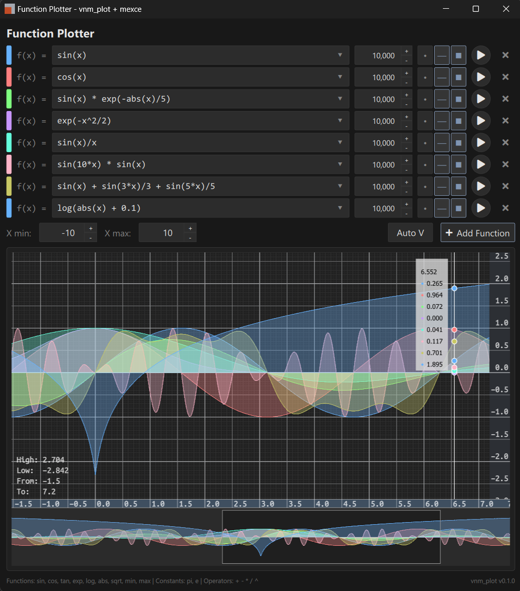

# vnm_plot
A GPU-accelerated 2D time-series plotting library using OpenGL, with optional Qt Quick integration.

<sub>function_plotter example</sub>
## CI Status
| Job | Status | Notes |
| :-- | :-- | :-- |
| Linux (GitHub Actions) | [](https://github.com/imakris/vnm_plot/actions/workflows/ci-linux.yml) | Core + GLFW + Core+Text |
| Windows (GitHub Actions) | [](https://github.com/imakris/vnm_plot/actions/workflows/ci-windows.yml) | Core + GLFW + Core+Text |
| FreeBSD Core (Cirrus) | [](https://cirrus-ci.com/github/imakris/vnm_plot?task=FreeBSD%20Core%20Build) | Core only |
| FreeBSD GLFW Example (Cirrus) | [](https://cirrus-ci.com/github/imakris/vnm_plot?task=FreeBSD%20GLFW%20Example) | standalone_glfw |
| FreeBSD Core+Text (Cirrus) | [](https://cirrus-ci.com/github/imakris/vnm_plot?task=FreeBSD%20Core%2BText%20Build) | Text enabled |

## Overview

vnm_plot renders time-series data using OpenGL geometry shaders. It supports Level-of-Detail (LOD) for handling large datasets. The renderer automatically selects an appropriate resolution based on the current zoom level.

The library uses a type-erased data interface (`vnm::plot::Data_source` + `vnm::plot::Data_access_policy`) so it can work with any sample type without templates in the rendering code.
Data sources decide whether snapshots are copies or direct views; buffering, if needed, lives in the data source.

Public header: include `#include <vnm_plot/vnm_plot.h>` only. It exposes core types unconditionally, and the Qt widgets when built with Qt (`VNM_PLOT_WITH_QT`).

## Architecture

```
vnm_plot_core (standalone core library)
  -> Chrome_renderer (grid and axes)
  -> Series_renderer (data series)
  -> Text_renderer (labels)
  -> Font_renderer (MSDF glyphs)

vnm_plot (Qt wrapper)
  -> Plot_widget (QQuickFramebufferObject)
     -> Plot_renderer (GL thread)
        -> vnm_plot_core
```

- `vnm_plot_core` is the standalone rendering and data logic
- `vnm_plot` is the Qt Quick wrapper (QML-friendly Plot_widget)
- `Plot_renderer` runs on the GL thread and coordinates the sub-renderers
- `Series_renderer` handles lines, dots, and area fills with VBO management
- `Chrome_renderer` draws the grid and axes
- `Font_renderer` generates MSDF glyph atlases from FreeType

## Usage

### Plotting a Function

```cpp
#include <vnm_plot/vnm_plot.h>

// plot_widget is a vnm::plot::Plot_widget* from QML or C++
// Create data source and generate samples
auto source = std::make_shared<vnm::plot::Function_data_source>();
source->generate([](double x) { return std::sin(x); }, 0.0, 10.0, 1000);

// Create series
auto series = std::make_shared<vnm::plot::series_data_t>();
series->id = 0;
series->data_source = source;
series->style = vnm::plot::Display_style::LINE;
series->color = glm::vec4(0.2f, 0.6f, 1.0f, 1.0f);

// Set up access policy
auto policy = vnm::plot::make_function_sample_policy();
series->access = policy;

// Add to widget
plot_widget->add_series(series->id, series);
```

### QML Quickstart

Register the type in C++:

```cpp
#include <vnm_plot/vnm_plot.h>

qmlRegisterType<vnm::plot::Plot_widget>("VnmPlot", 1, 0, "PlotWidget");
qmlRegisterType<vnm::plot::Plot_time_axis>("VnmPlot", 1, 0, "PlotTimeAxis");
```

Use it in QML:

```qml
import VnmPlot 1.0

PlotWidget {
    id: plot
    anchors.fill: parent
}
```

Shared time axis across plots:

```qml
import VnmPlot 1.0

PlotTimeAxis { id: sharedAxis }

Column {
    PlotView { timeAxis: sharedAxis }
    PlotView { timeAxis: sharedAxis }
}
```

### Custom Sample Types

Implement a `vnm::plot::Data_access_policy` to tell the renderer how to read your samples:

```cpp
struct my_sample_t {
    double timestamp;
    float  value;
    float  low;
    float  high;
};

vnm::plot::Data_access_policy make_my_policy() {
    vnm::plot::Data_access_policy p;
    p.get_timestamp = [](const void* s) {
        return static_cast<const my_sample_t*>(s)->timestamp;
    };
    p.get_value = [](const void* s) {
        return static_cast<const my_sample_t*>(s)->value;
    };
    p.get_range = [](const void* s) {
        auto* sample = static_cast<const my_sample_t*>(s);
        return std::make_pair(sample->low, sample->high);
    };
    p.sample_stride = sizeof(my_sample_t);
    return p;
}

// Assign policy to a series
auto series = std::make_shared<vnm::plot::series_data_t>();
series->access = make_my_policy();
```

### Display Styles

- `DOTS` - points
- `LINE` - connected line
- `AREA` - filled area
- `COLORMAP_AREA` - area colored by auxiliary metric
- Combinations: `DOTS_LINE`, `LINE_AREA`, `DOTS_LINE_AREA`

## Building

```bash
cmake -S . -B build -DCMAKE_BUILD_TYPE=Release
cmake --build build
```

Qt 6 (Core, Gui, Quick, OpenGL) is optional. The build fetches glm, glatter,
FreeType, and msdfgen if they are not already available as targets.

To build the standalone core library only:

```bash
cmake -S . -B build -DCMAKE_BUILD_TYPE=Release -DVNM_PLOT_BUILD_QT=OFF
cmake --build build
```

To disable text rendering (skips FreeType + msdfgen):

```bash
cmake -S . -B build -DCMAKE_BUILD_TYPE=Release -DVNM_PLOT_ENABLE_TEXT=OFF
cmake --build build
```

## Examples

Enable examples with:

```bash
cmake -S . -B build -DCMAKE_BUILD_TYPE=Release -DVNM_PLOT_BUILD_EXAMPLES=ON
cmake --build build
```

- `vnm_plot_hello` - renders a sine wave using `Function_data_source`
- `function_plotter` - multiple functions, per-series styles, expression evaluation via mexce
- `standalone_glfw` - standalone core validation example using GLFW

`function_plotter` depends on `mexce`. You can point at a local checkout by
configuring with `-DMEXCE_LOCAL_PATH=...`.

## Configuration

Customize rendering via `Plot_config`:

```cpp
vnm::plot::Plot_config config;
config.dark_mode = true;
config.line_width_px = 2.0;
config.auto_v_range_mode = vnm::plot::Auto_v_range_mode::VISIBLE;
config.format_timestamp = [](double ts, double range) {
    return my_format_time(ts, range);
};
plot_widget->set_config(config);
```

## Integration

As a subdirectory:

```cmake
add_subdirectory(vnm_plot)
target_link_libraries(your_app PRIVATE vnm_plot::core)      # standalone core library
# target_link_libraries(your_app PRIVATE vnm_plot::vnm_plot) # Qt wrapper
```

Via FetchContent:

```cmake
include(FetchContent)
FetchContent_Declare(vnm_plot
    GIT_REPOSITORY https://github.com/imakris/vnm_plot.git
    GIT_TAG        1.0.4
)
FetchContent_MakeAvailable(vnm_plot)
target_link_libraries(your_app PRIVATE vnm_plot::core)      # standalone core library
# target_link_libraries(your_app PRIVATE vnm_plot::vnm_plot) # Qt wrapper
```

## Requirements

- OpenGL 4.3+ with geometry shader support and `GL_ARB_gpu_shader_int64`
- Qt 6.2+ (only required for the Qt wrapper target)

## Scope

vnm_plot is a time-series plotter. It does not support 3D, scatter plots, pie charts, bar charts, histograms, or built-in legends/annotations.

## License

BSD-2-Clause
