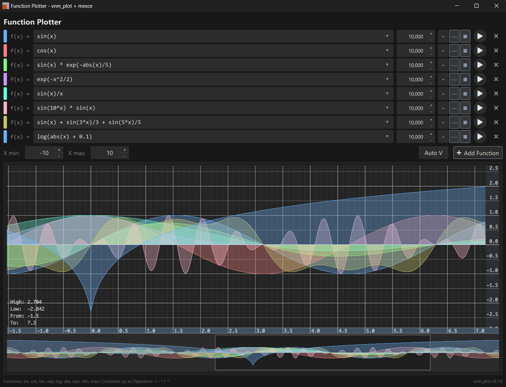

# vnm_plot

High-performance GPU-accelerated plotting library built on Qt Quick and OpenGL.

## Build

```bash
cmake -S . -B build -DCMAKE_BUILD_TYPE=Release
cmake --build build
```

Qt 6 (Core, Gui, Quick, OpenGL) is required. The build fetches glm, glatter,
FreeType, and msdfgen if they are not already available as targets.

## Examples


<sub>function_plotter example</sub>

Enable examples by configuring with:

```bash
cmake -S . -B build -DVNM_PLOT_BUILD_EXAMPLES=ON
cmake --build build
```

The example `vnm_plot_hello` renders a sine wave using `Function_data_source`.
The example `function_plotter` is a more advanced demo with multiple functions,
per-series styles, and expression evaluation via mexce.
