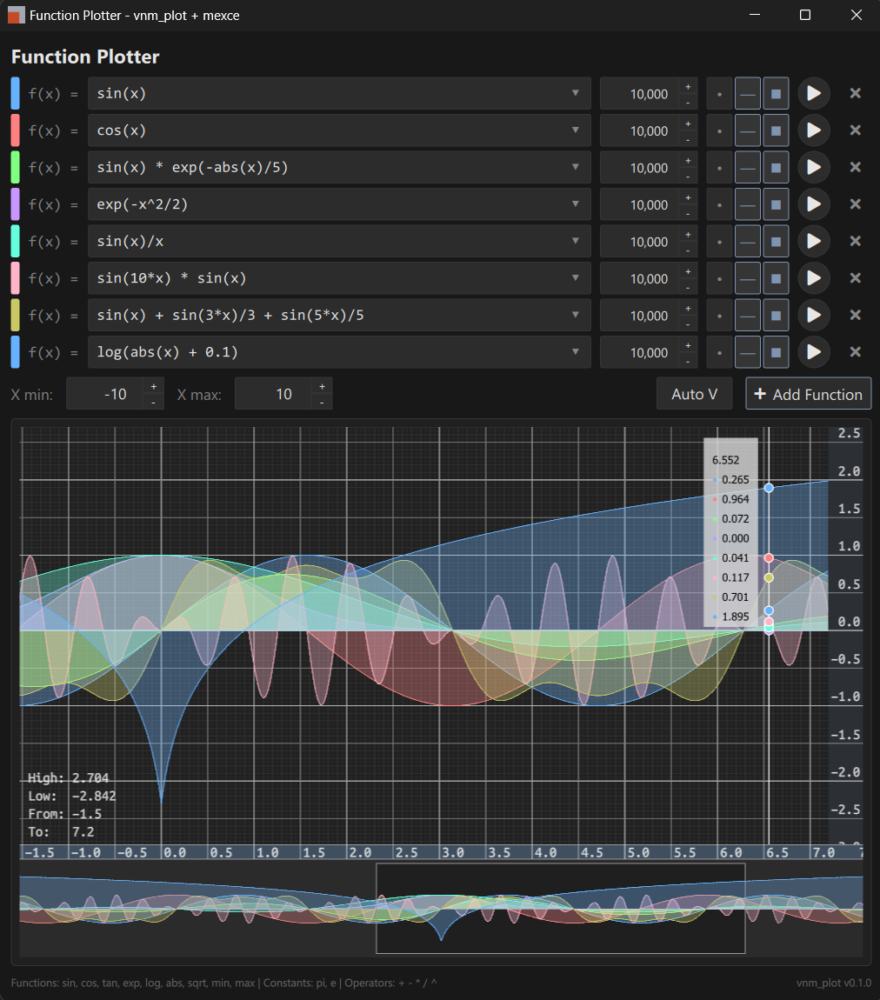

# vnm_plot
A GPU-accelerated 2D time-series plotting library using Qt RHI and Qt Quick.

<sub>function_plotter example</sub>
## CI Status
[](https://github.com/imakris/vnm_plot/actions/workflows/ci-linux.yml) [](https://github.com/imakris/vnm_plot/actions/workflows/ci-macos.yml) [](https://github.com/imakris/vnm_plot/actions/workflows/ci-windows.yml) [](https://github.com/imakris/vnm_plot/actions/workflows/ci-freebsd.yml)

## Overview

vnm_plot renders time-series data through Qt RHI. It supports Level-of-Detail (LOD) for handling large datasets. The renderer automatically selects an appropriate resolution based on the current zoom level.

The library uses a type-erased data interface (`vnm::plot::Data_source` + `vnm::plot::Data_access_policy`) so it can work with any sample type without templates in the rendering code.
Data sources decide whether snapshots are copies or direct views; buffering, if needed, lives in the data source.

Public headers: `#include <vnm_plot/vnm_plot.h>` (umbrella),
`#include <vnm_plot/core.h>` (data/layout API), `#include <vnm_plot/rhi.h>`
(QRhi renderer and custom-layer API), and `#include <vnm_plot/qt.h>` (Qt Quick
API when built with Qt, `VNM_PLOT_WITH_QT`).

## Architecture

```
vnm_plot_data
  -> Data_source, snapshots, access policies, time units, query APIs

vnm_plot_layout
  -> Layout_calculator, range/window planning, formatting helpers
  -> vnm_plot_data

vnm_plot_rhi
  -> Asset_loader, Chrome_renderer, Series_renderer, Text_renderer, Font_renderer
  -> custom QRhi series layers
  -> vnm_plot_layout

vnm_plot_qtquick
  -> Plot_widget (QQuickRhiItem), Plot_time_axis, interactions, QML resources
  -> vnm_plot_rhi
```

- `vnm_plot_data` and `vnm_plot_layout` are Qt-private-free in their link interfaces
- `vnm_plot_rhi` owns built-in QRhi renderers, shader resources, font/text
  rendering, asset loading, and the custom QRhi series-layer API
- `vnm_plot_qtquick` is the Qt Quick wrapper (QML-friendly Plot_widget)
- `Plot_renderer` runs on the Qt RHI render thread and coordinates the sub-renderers
- `Series_renderer` handles lines, dots, and area fills with VBO management
- `Chrome_renderer` draws the grid and axes
- `Font_renderer` generates MSDF glyph atlases from FreeType

## Usage

### Plotting Samples

```cpp
#include <vnm_plot/vnm_plot.h>

struct sample_t
{
    std::int64_t t_ns;
    float        value;
};

std::vector<sample_t> samples;
samples.push_back({0, 0.0f});
samples.push_back({1'000'000'000, 1.0f});

auto source = std::make_shared<vnm::plot::Vector_data_source<sample_t>>();
source->set_data(std::move(samples));

auto access = vnm::plot::make_access_policy<sample_t>(
    &sample_t::t_ns,
    &sample_t::value);

auto series = vnm::plot::Series_builder()
    .style(vnm::plot::Display_style::LINE)
    .color(vnm::plot::rgba_u8(51, 153, 255))
    .data_source(source)
    .access(access)
    .build_shared();

plot_widget->add_series(0, series);
```

### Stacked series

Give two or more ordinary series the same non-zero stack group. Group `0`
keeps a series independent.

```cpp
auto f_source = std::make_shared<vnm::plot::Vector_data_source<sample_t>>();
f_source->set_data(std::vector<sample_t>{{0, 1.0f}, {1'000'000'000, 2.0f}});

auto g_source = std::make_shared<vnm::plot::Vector_data_source<sample_t>>();
g_source->set_data(std::vector<sample_t>{{0, 3.0f}, {1'000'000'000, 4.0f}});

const auto access = vnm::plot::make_access_policy<sample_t>(
    &sample_t::t_ns,
    &sample_t::value);

auto f = vnm::plot::Series_builder()
    .style(vnm::plot::Display_style::AREA)
    .stack_group(1)
    .data_source(f_source)
    .access(access)
    .build_shared();

auto g = vnm::plot::Series_builder()
    .style(vnm::plot::Display_style::AREA)
    .stack_group(1)
    .data_source(g_source)
    .access(access)
    .build_shared();

plot_widget->add_series(10, f); // bottom
plot_widget->add_series(20, g); // top; cumulative value is f + g
```

Series are stacked bottom-to-top in ascending plot-ID order. Reordering a
stack therefore also means updating the caller's plot-ID mapping and series
registrations. `LINE` and `DOTS` draw cumulative values; `AREA` fills each
component's band between its cumulative base and top. Preview sources and
styles are composed the same way in the preview view.

Each source retains its independently selected LOD and timestamp grid. The
renderer uses their exact timestamp union when it fits the view's composition
budget. Larger unions are interpolated onto a shared deterministic grid that
targets half-pixel spacing, clipped to the common selected-source time domain.
The grid retains both domain endpoints and is capped so one stack view never
materializes more than 1,048,576 cumulative samples across all layers; very
large layer counts therefore use a coarser grid. Main and preview use their own
horizontal pixel widths and budgets. Members must use
matching `Series_interpolation` modes and, after sample and nonfinite-policy
handling, produce a single continuous drawable selected window with monotonic
timestamps. A rejected group fails closed: the affected stack view is omitted
instead of drawing misleading unstacked data, and its reason is queryable via
`stack_status` or `get_stack_status`. When configured, the optional
`Plot_config::log_error` callback may also receive a human-readable message.
Bounded resampling is an accepted `ACTIVE` result, not a rejection. Features
narrower than half a pixel may be omitted, and a `STEP_AFTER` transition may
move to the next grid timestamp; indicators and auto-fit continue to match the
geometry actually rendered.

Stack acceptance is also queryable without installing a log callback. C++ can
call `Plot_widget::stack_status(group, Series_view_kind::MAIN)` (or `PREVIEW`)
and inspect its typed `state`, `reason`, and `affected_series_ids`. `PENDING`
means no renderer result matches the current data and range, `ACTIVE` means the
view was accepted, and `SUPPRESSED` includes the specific rejection reason. A
singleton group is `ACTIVE` with no rejection because no composition is needed.
QML can call `get_stack_status(group, preview)`; the returned map contains
`group`, uppercase `view`, `state`, and `reason` strings, plus an
`affected_series_ids` list.

The final cumulative value gets an automatic line overlay two pixels thicker
than `Plot_config::line_width_px`: `#E6DFCC` in dark mode and `#192033` in light
mode. This applies to the main and preview views for `LINE`, `DOTS`, and `AREA`
stacks.

`PlotIndicator` keeps component text values raw while placing their markers on
the cumulative rendered layers. It adds a text-only `Σ` total and the note
"Markers show cumulative stack positions". `Plot_widget::auto_adjust_view()`
(used by the function plotter's **Fit Vertical** button) fits current cumulative
stack geometry, including `AREA` bases.

**Thread Safety**
`Plot_widget` renders on a separate RHI render thread. Treat `series_data_t` as immutable once added. To change series config (style, access policy, preview config, color), update a copy and call `add_series` again with the same id to replace it. Make sure your `Data_source` implementation is safe to read from the render thread.

### QML Quickstart

Register the type in C++:

```cpp
#include <vnm_plot/vnm_plot.h>

qmlRegisterType<vnm::plot::Plot_widget>("VnmPlot", 1, 0, "PlotWidget");
qmlRegisterType<vnm::plot::Plot_time_axis>("VnmPlot", 1, 0, "PlotTimeAxis");
```

Use it in QML:

```qml
import VnmPlot 1.0

PlotWidget {
    id: plot
    anchors.fill: parent
}
```

Shared time axis across plots:

```qml
import VnmPlot 1.0

PlotTimeAxis { id: sharedAxis }

Column {
    PlotView { time_axis: sharedAxis }
    PlotView { time_axis: sharedAxis }
}
```

### Custom Sample Types

Implement a `vnm::plot::Data_access_policy` to tell the renderer how to read your samples:

```cpp
struct my_sample_t
{
    double timestamp;
    float  value;
    float  low;
    float  high;
};

auto policy = vnm::plot::make_access_policy<my_sample_t>(
    &my_sample_t::timestamp,
    &my_sample_t::value,
    &my_sample_t::low,
    &my_sample_t::high);

// Assign policy to a series
auto series = std::make_shared<vnm::plot::series_data_t>();
series->access = policy.erase();
```

### Display Styles

- `DOTS` - points
- `LINE` - connected line
- `AREA` - filled area
- `COLORMAP_AREA` - area colored by auxiliary metric
- Combinations: `DOTS_LINE`, `LINE_AREA`, `DOTS_LINE_AREA`

## Building

```bash
cmake -S . -B build -DCMAKE_BUILD_TYPE=Release
cmake --build build
```

Qt 6 (Core, Gui, Quick, GuiPrivate, ShaderTools) is required. The build fetches
glm when it is not already available. Public vnm_plot headers use the
dependency-light `vnm_msdf_text` LCD contract component. When text rendering is
enabled, vnm_plot also uses the full `vnm_msdf_text` MSDF atlas path. CMake uses
a sibling `../vnm_msdf_text` checkout when present, otherwise it fetches the
GitHub `master` branch. The atlas path fetches FreeType and msdfgen when they
are not already available as targets.

CI currently builds QRhi and QRhi+Text on Linux, macOS, Windows, and FreeBSD.
The GitHub Actions jobs use the Qt 6.10.1 SDK on Linux, macOS, and Windows so
the QRhi private headers and `qsb` shader compiler are available consistently.

To disable text rendering (skips the full MSDF atlas/text renderer path, while
still keeping the public LCD contract dependency):

```bash
cmake -S . -B build -DCMAKE_BUILD_TYPE=Release -DVNM_PLOT_ENABLE_TEXT=OFF
cmake --build build
```

## Examples

Enable examples with:

```bash
cmake -S . -B build -DCMAKE_BUILD_TYPE=Release -DVNM_PLOT_BUILD_EXAMPLES=ON
cmake --build build
```

- `vnm_plot_hello` - renders a sine wave using the example function-source helper
- `vnm_plot_preview_config` - preview uses a separate data source and AREA style via `preview_config`
- `function_plotter` - expressions, per-series styles, and a stacked-series demo via mexce

`function_plotter` is opt-in because it depends on Qt Multimedia and `mexce`.
Build it with `-DVNM_PLOT_BUILD_EXAMPLES=ON -DVNM_PLOT_BUILD_FUNCTION_PLOTTER=ON`;
point at a local mexce checkout with `-DMEXCE_LOCAL_PATH=...`.
Use its **Σ** control to stack functions, drag a function's color accent or
label to change bottom-to-top order, and use **Fit Vertical** to fit the stack.

## Configuration

Customize rendering via `Plot_config`:

```cpp
vnm::plot::Plot_config config;
config.dark_mode = true;
config.line_width_px = 2.0;
config.auto_v_range_mode = vnm::plot::Auto_v_range_mode::VISIBLE;
config.format_timestamp = [](double ts, double range) {
    return my_format_time(ts, range);
};
plot_widget->set_config(config);
```

## Integration

As a subdirectory:

```cmake
add_subdirectory(vnm_plot)
target_link_libraries(your_app PRIVATE vnm_plot::qtquick)
```

Via FetchContent:

```cmake
include(FetchContent)
FetchContent_Declare(vnm_plot
    GIT_REPOSITORY https://github.com/imakris/vnm_plot.git
    GIT_TAG        master
)
FetchContent_MakeAvailable(vnm_plot)
target_link_libraries(your_app PRIVATE vnm_plot::qtquick)
```

For non-Qt consumers, link the narrow target needed by the code:

```cmake
target_link_libraries(data_tool PRIVATE vnm_plot::data)
target_link_libraries(layout_tool PRIVATE vnm_plot::layout)
target_link_libraries(rhi_tool PRIVATE vnm_plot::rhi)
```

This source tree declares CMake project version `0.1.0`. Varinomics-owned
consumers intentionally track `master` so integration breakage surfaces and is
fixed immediately instead of being hidden by revision pins. External consumers
may still use installed or package-manager-provided builds.

Install exports are find_package-ready only when exported dependencies are
already imported package targets. Configure with `-DVNM_PLOT_USE_SYSTEM_LIBS=ON`
and provide find_package-able `glm` and `vnm_msdf_text` with at least the
`lcd_contract` component for public vnm_plot headers and `vnm_plot::data` /
`vnm_plot::layout` consumers. Text-enabled `vnm_plot::rhi` and
`vnm_plot::qtquick` package consumers also need the `atlas` component. When
those dependencies are built locally through FetchContent, install still
installs headers and libraries, but skips the CMake package export because
CMake cannot export those local dependency targets from this project.

Installed package targets are `vnm_plot::data`, `vnm_plot::layout`,
`vnm_plot::rhi`, and `vnm_plot::qtquick`. Requesting the `data` or `layout`
components does not require Qt private modules. Requesting `rhi` or `qtquick`
requires Qt GuiPrivate because those targets use QRhi. Qt ShaderTools is
required only when building vnm_plot from source.

## Requirements

- Qt 6.7+ with Qt Shader Tools

## License

BSD-2-Clause
